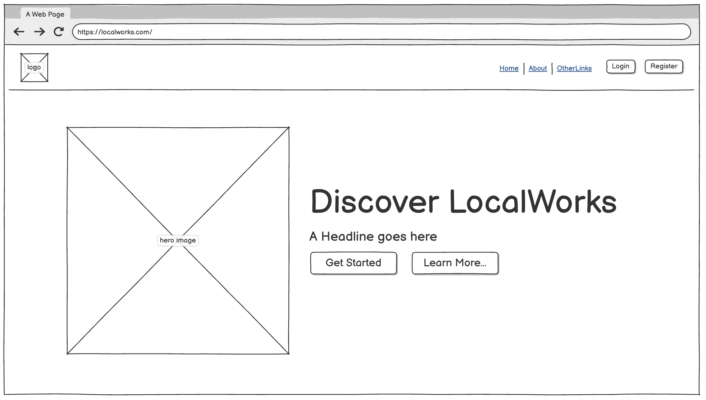
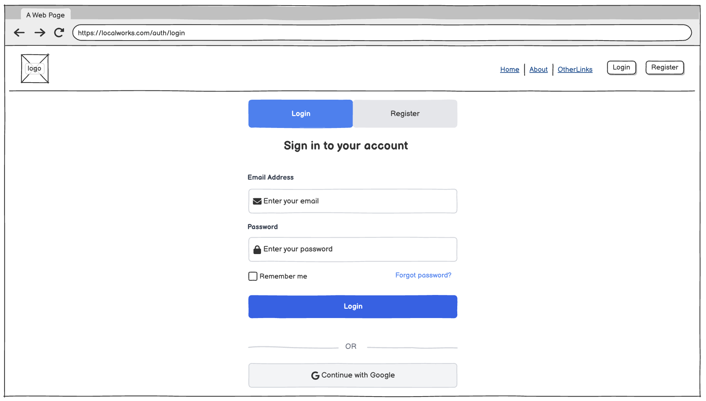
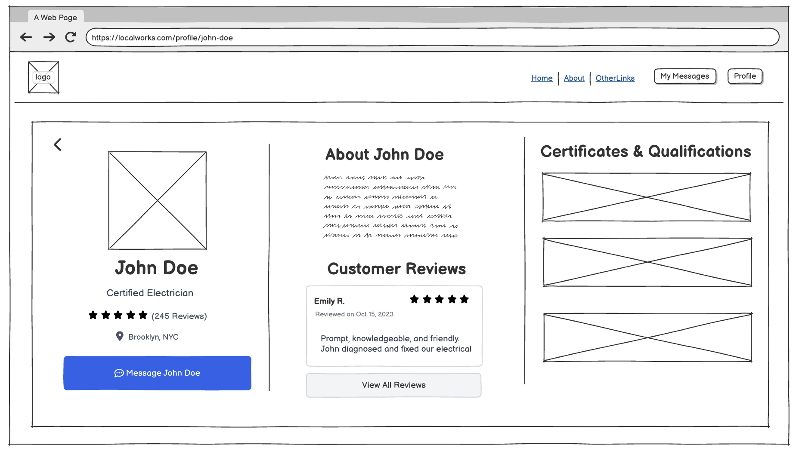
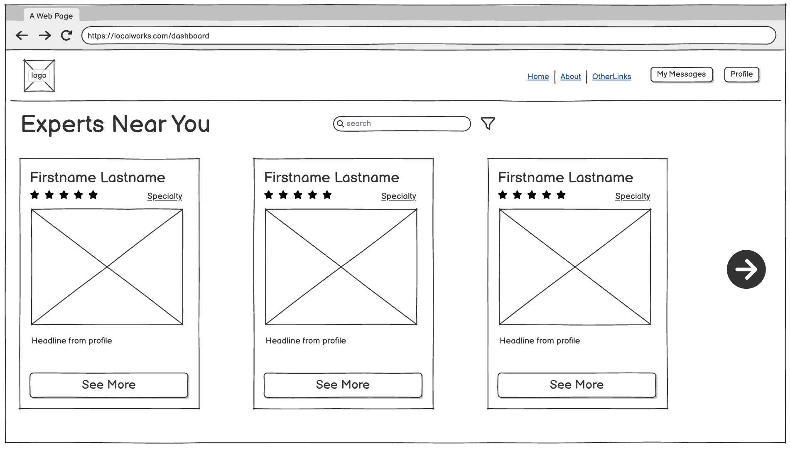
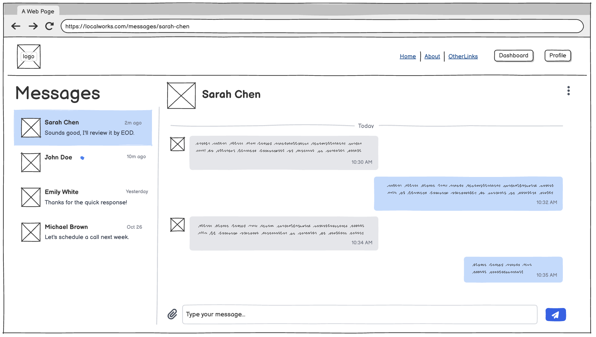
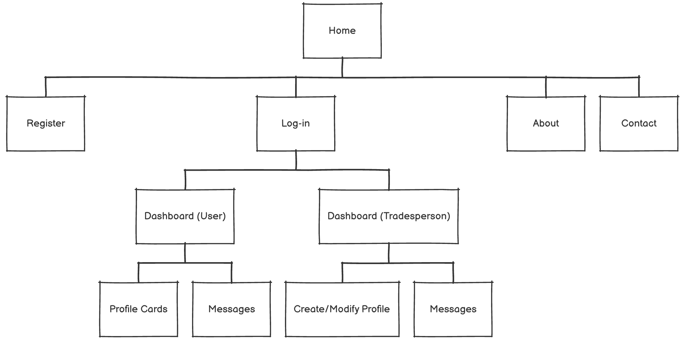

# LocalWorks

## Overview

### Wake up to solutions, not problems.

You hear that familiar drip -- the leaky sink you’ve been meaning to fix but haven’t found the time to call someone for. With LocalWorks, that’s no longer a problem.

Whether you’re a homeowner or a property manager, LocalWorks connects you with trusted local professionals ready to help -- from plumbers and electricians to handymen and more. Find the right expert for your job in just minutes.

### About LocalWorks

LocalWorks is an intuitive web platform that helps homeowners and property managers discover skilled local tradespeople. Users can browse verified profiles, view credentials and service details, and connect directly with professionals for quotes or inquiries.

Anyone can join -- register as a customer to find help, or as a service provider to offer your expertise. Tradespeople can showcase their skills, credentials, rates, and service areas through personalized public profiles, making it easy for clients to find and trust the right professional for the job.

## Data Model

The application will store Users, Profiles, Reviews, Conversations, and Messages

-   users can have one profile (if they register as a tradesperson)

-   profiles can have multiple reviews (from different users)

-   users can have multiple conversations (with tradespeople)

-   each conversation can have multiple messages

-   messages belong to one conversation and one sender / receiver

### Sample Documents

An Example User:

```javascript
{
  _id: // generated ID,
  name: // user's full name
  email: "user@example.com", // user email
  passwordHash: "$2b$10$hashhashhash", // password hashed
  role: "user", // default is user but can be tradesperson or possibly admin
  createdAt: // timestamp
  updatedAt: // timestamp
}
```

An Example Profile:

```javascript
{
  _id: // unique profile id
  user: // a reference to a user
  displayName: // name
  headline: "Licensed Electrician, 8+ yrs", // short profile message
  skills: ["electrical", "lighting", "panel upgrade"], // user defined
  credentials: [
    {"label": "State Electrical License", "issuer": "NY State", "id": "ELC-987654"}
  ], // user defined
  bio: "I help homeowners upgrade panels and improve lighting safely.",
  rate: {currency: "USD", amount: 85, unit: "hour"}, // optional rates
  location: {city: "Brooklyn", state: "NY", lat: 40.6782, lng: -73.9442}, // approx location
  serviceRadiusKm: 25,
  photos: ["https://…/profile1.jpg"], // profile photos maybe photos of jobs
  isPublished: true, // flag for having drafts (maybe)
  avgRating: 4.8, // determined by reviews either number or NULL
  reviewCount: 12,
  createdAt: // timestamp
  updatedAt: // timestamp
}
```

An Example Review:

```javascript
{
  _id: // unique id
  reviewer: // reference to user id
  profile: // reference to tradespersons profile by id
  rating: 5,
  comment: "Quick response and great workmanship.",
  createdAt: // timestamp
}
```

An Example Conversation:

```javascript
{
  _id: // unique conversation id
  participants: [], // user Ids (trades person + user)
  lastMessageAt: // timestamp
  createdAt: // timestamp
}
```

An Example Message:

```javascript
{
  _id: // unique id
  conversation: // reference to conversation id
  sender: // reference to user who sent
  text: "Hi Bob, are you available this Saturday?",
  createdAt: // timestamp
  readAt: null // timestamp (maybe)
}
```

## [First Draft Schema](src/db.mjs)

The first draft of the mongoose schemas is linked above. These are subject to change.

## Wireframes

/ - home page / landing page



/auth/(login or register)



/profile/:profile-slug (tradesperson)



/dashboard (logged in user view)



/messages



## Site map



## User Stories or Use Cases

-   As a visitor, I can search by skill and location to find relevant tradespeople.
-   As a visitor, I can view a tradesperson’s public profile to assess fit.
-   As a user, I can register and log in to access private features.
-   As a tradesperson, I can create and publish my profile to get discovered.
-   As a user, I can start a conversation with a tradesperson to discuss a job.
-   As a user, I can see my conversation history and exchange messages in real time.
-   As a user, I can leave a review for a completed job to help others.

## Research Topics

These are subject to change based on their complexity and time. I have listed the topics that I am currently most interested in and will adjust according to time and complexity.

-   (4 points) Integrate user authentication

    -   Use passport.js for user authentication
    -   Mid - Challenging

-   (2 points) Tailwind.css

    -   Would like to explore how this might improve the workflow
    -   Works well with React.js
    -   Easy - Mid

-   (2 points) Integrate ESLint into your workflow

    -   Use ESLint with Vite (via vite-plugin-eslint) to lint the entire codebase on save
    -   Easy - Mid

-   (6 points) Use a React framework for front-end

    -   Will allow for custom components and a modern frontend
    -   Challenging

-   (4 points) Real-time chat with Socket.IO (maybe?)

    -   Use socket.io for a real time chat feature
    -   Mid – Challenging

## [Link to Initial Main Project File](src/app.mjs)

## Annotations / References Used

I will probably use these:

-   [passport.js authentication docs](http://passportjs.org/docs)

-   [react docs](https://react.dev/reference/react)

-   [tailwind docs](https://tailwindcss.com/docs/installation/using-vite)
